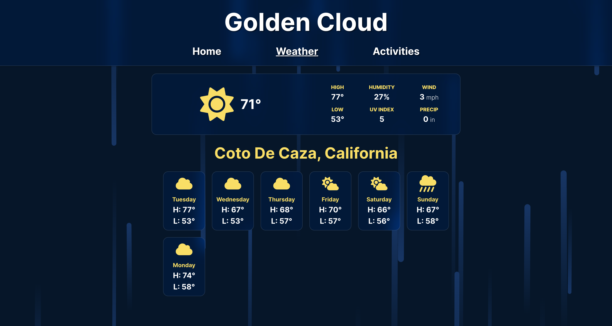

# Weather and Activity App - Golden Cloud

This is a multipage appplication that uses geolocation to give current weather and a 7 day temperature forecast, as well as suggests random activities for the user based on the weather in the users location.

## Weather

Golden Cloud uses https://open-meteo.com/ API to attain weather data and render it to the /weather page.

## Activities

Golden Cloud again uses https://open-meteo.com/ API to get the current weather and conditionally requests https://www.boredapi.com/ for a random activity based on the weather on the /activities page.

Conditions are as follows:

- if the skies are clear or mostly clear and the temperature is above 60 degrees, Golden Cloud requests a truly random activity from Bored API via https://www.boredapi.com/api/activity

- if the skies are not clear or the temperature is equal to or below 60 degrees, Golden Cloud randomly requests one of four indoor activity types via https://www.boredapi.com/api/activity?type=education, https://www.boredapi.com/api/activity?type=busywork, https://www.boredapi.com/api/activity?type=cooking, or https://www.boredapi.com/api/activity?type=music

## Using the App

### Live deploy can be visited here: [Golden Cloud](https://golden-cloud.netlify.app/)

To host the application locally follow the steps below:

1. Clone this repository to your local machine using `git clone https://github.com/gregbeas/weather-activity-app`

2. In the terminal, run command `npm install` to install all required dependencies

3. In the terminal, run command `npm run dev`, and follow the steps in your terminal to open localhost in your browser

4. To run a production version of the application run command `npm run build` to build the project and create the distriubution folder, then run command `npm run preview` and follow the steps in your terminal to open localhost in your browser.

